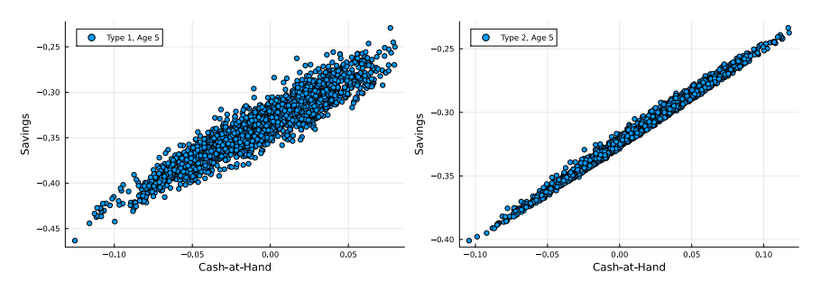

# Self-Justified Equilibria (SJE): Existence and Computation

<p align="center">

</p>

## Description of programs and datasets used

### Organization of the repository

This [Julia-based](https://julialang.org/) code repository supplements the work of [Felix Kuebler](https://sites.google.com/site/fkubler/) and [Simon Scheidegger](https://sites.google.com/site/simonscheidegger), titled _[Self-Justified Equilibria: Existence and Computation](#citation)_ (Kubler and Scheidegger; Journal of the European Economic Association (JEEA), 2025).

* This repository contains two distinct folders:
  1. ["Replication codes"](code): Replication codes for *Section 6 - Application of SJE: A High-Dimensional Stochastic Production Economy*, where a complex, nonlinear, high-dimensional stochastic production economy is solved with the SJE algorithm. 
  Notice that the codes provided here complement *Section 5 - The numerical method*, where the algorithmic underpinnings of the code are outlined.
      
  2. ["Replication of figures"](code/figures_replication): Replication routine for plotting all the figures that are presented in the paper.

  
### Replication of the numerical results

* To replicate the results of the article step-by-step, a detailed set of instructions is provided _[here](#Replication)_.
  
    
## Computational requirements

### Software requirements

* We provide implementations that use Julia 1.9. 

* The file ``Project.toml `` lists the detailed dependencies for Julia. See [here](https://pkgdocs.julialang.org/v1/toml-files/) for detailed instructions how on how to set up and use the ``Project.toml`` file in a Julia project.


### Memory and runtime requirements

* To solve one 120-dimensional overlapping generations model solved with SJE as discussed in *Section 6 - Application of SJE: A High-Dimensional Stochastic Production Economy* until full convergence from scratch, it requires about 11.000 seconds (3 hours, with 10 Threads) on off-the-shelve hardware. 

* All the models presented in the paper were solved using a 12-core Mac Mini Pro (Apple M4 Chip, 12-Core CPU, 16 Core GPU) with 24GB of RAM, and 512GB of fast local storage (SSD).

* All the postprocessing codes (to produce the summary statistics, plots, and so forth) were run on the same hardware and consume typically few seconds to run.

* The approximate time needed to reproduce all the analyses for this paper on a standard (year 2025) desktop machine is 1 day of human time.


## Replication

* This section provides instructions on how to replicate the numerical results of section 6 of this article.

* The optimal optimal order of running the computer code to replicate the results in article are as follows. 
  1. Run the instructions listed in the subsection ``1. Replication of Section 6: Application of SJE: A High-Dimensional Stochastic Production Economy``. This set of instructions will allow you to replicate the results of section 6 of the article. 
  2. Run the instructions listed in ``2. Create Figures``. This set of instructions will allow you to replicate the figures of section 6 of the article, created from pre-computed restart/result files.

  
### 1. Replication of Section 6: Application of SJE: A High-Dimensional Stochastic Production Economy

In this section, we provide the basic instructions on how to compute the numerical results presented in section 6 of the article.

First, go to the following folder:

```
$ cd <PATH to the repository>/code
```

Next, make sure you have the packages "LinearAlgebra", "NLsolve", "Plots", and "RawArray" are installed. You can do this by launching Julia in a terminal, and then type the following commands:

```
julia> using Pkg
julia> Pkg.add("LinearAlgebra")
julia> Pkg.add("NLsolve")
julia> Pkg.add("Plots")
julia> Pkg.add("RawArray)
```

To solve the model from scratch, execute:

```
$ julia mainhom.jl
```

* The header of ``mainhom.jl`` specifies the various functions we require to solve the model with SJE.

* ``mainhom.jl`` includes the file ``paramshom.jl``; it contains the parameterization of the model, and its header provides some more specifics. 


### 2. Create figures

In this section, we provide the basic instructions on how to replicate the 3 figures of the article, based on pre-computed results.

First, go to the following folder:

```
$ cd <PATH to the repository>/code 
```

Next, you need to run a Julia script called ``figures.jl``. To do so, type the following command on the terminal:

```
$ julia figures.jl
```

This script loads pre-computed results, located [here](code/data_replication):

```
$ <PATH to the repository>/code/data_replication 
```

and will store the resulting plots [(Figure1.pdf, Figure2.pdf, and Figure3.pdf).](code/figures_replication)

```
$ <PATH to the repository>/code/figures_replication 
```


## Authors

* [Felix Kuebler](https://sites.google.com/site/fkubler/) (University of Zuerich, Department for Banking and Finance, and Swiss Finance Institute)
* [Simon Scheidegger](https://sites.google.com/site/simonscheidegger) (University of Lausanne, Department of Economics)


## Citation

Please cite [Self-Justified Equilibria: Existence and Computation](https://papers.ssrn.com/sol3/papers.cfm?abstract_id=3494876) in your publications if it helps your research:

```
@article{kubler2019self,
  title={Self-justified equilibria: Existence and computation},
  author={Kubler, Felix and Scheidegger, Simon},
  journal={Available at SSRN 3494876},
  year={2019}
}

```


## Support

This work was generously supported by grants from the [Swiss National Science Foundation](https://www.snf.ch) under project IDs "Can economic policy mitigate climate change," "New methods for asset pricing with frictions,” and the [Enterprise for Society (E4S)](https://e4s.center).

